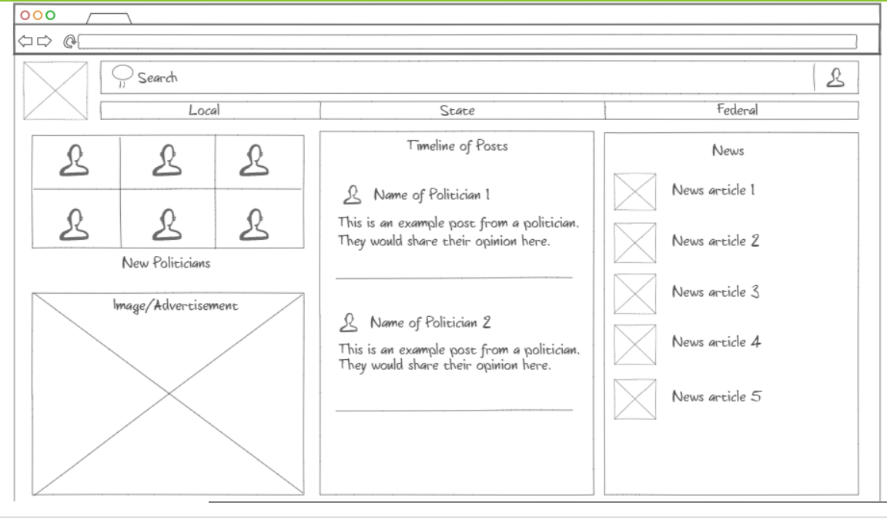

# Startup
A startup web application created for a web programming course

### SSH (w/ key pair) Command: 
`ssh -i [key pair file] ubuntu@[ip address]`

### My EC2 IP 
`3.142.176.217`

## Startup Project Pitch
Every election season, tons of voters go to the polls. Most of them submit a ballot based on party politics -- they either vote entirely for republicans or entirely for democrats. Only 4% of voters in the last presidential election voted for a senator from the opposite policital party of their preferred presidential candidate. This is likely due (in part) to a lack of political knowledge and education. Voters are not informed on the topics that are important to the candidates. Rather, voters are forced to form political opinions based off of campaign ads or debate speeches that target the personal flaws of candidates. Voters never learn the candidate's real goals or values. The application I want to build will be a non-partisan political education tool. In terms of look and feel, it will be similar to prevailing social media applications. However, only verified politicians will be given access to make posts. There will be no commenting, sharing, or liking. The average American will only be able to read posts. This will create an environment in which political candidates can share their true views on important topics, so that voters can make informed decisions.

## Key Features
* Sharing of text-based posts or "statuses"
* Sharing of news
* Creation of a scrollable "timeline" so the end-user can peruse the posts of different politicians
* No need for "following" or "friending" certain users - every post will be made available on the timeline of every user (this will work for now with a small-scale application but may change)

### Potential Features
* Separation of timeline into local, state, and federal levels
* Real-time polls or debates between candidates online

## Low-Fidelity Prototype

### Notes from Simon HTML Project
* Learned about the menu element (can be a replacement for an OL or UL)
* Learned about the sup element that allows for superscript
* Learned what "&reg" does (creates a registered trademark symbol)
* Learned about the link tag for inside the head
* Learned a general structure that is easy to follow: header, main, footer
* Learned how to implement the table, and what a th does

### Notes from Simon CSS Project
* Learned a little bit more about Bootstrap framework (and how it is implemented into the HTML files)
* Uses the class="" syntax a lot to define a class for each element so that Bootstrap can apply CSS to it
* Learned in more detail about flexboxes and how they work

### Notes from Startup HTML/CSS Project
* There are websites out there that just have example Bootstrap elements with associated code.
* I learned when to use the "!important" keyword in CSS and when not to use it
* I became very comfortable editing style in a stylesheet
* I learned how to create and embed news (through RSS feeds and an aggregator)
